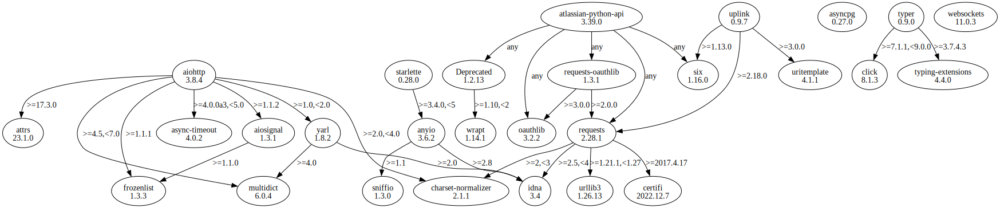

# Third Party Dependencies

<!--[[[fill sbom_sha256()]]]-->
The [SBOM in CycloneDX v1.4 JSON format](https://git.sr.ht/~sthagen/aikasilta/blob/default/etc/sbom/cdx.json) with SHA256 checksum ([8eda95ff ...](https://git.sr.ht/~sthagen/aikasilta/blob/default/etc/sbom/cdx.json.sha256 "sha256:8eda95ff2da0258d9a2b7d7c306e96a3cb6924ac4a78bf7ed104fa413711520f")).
<!--[[[end]]] (checksum: 44c1234578a15a5d67f648d1f0555644)-->
## Licenses 

JSON files with complete license info of: [direct dependencies](direct-dependency-licenses.json) | [all dependencies](all-dependency-licenses.json)

### Direct Dependencies

<!--[[[fill direct_dependencies_table()]]]-->
| Name                                                                          | Version                                                         | License                 | Author                                      | Description (from packaging data)                                  |
|:------------------------------------------------------------------------------|:----------------------------------------------------------------|:------------------------|:--------------------------------------------|:-------------------------------------------------------------------|
| [aiohttp](https://github.com/aio-libs/aiohttp)                                | [3.8.5](https://pypi.org/project/aiohttp/3.8.5/)                | Apache Software License | "aiohttp team" <team@aiohttp.org>           | Async http client/server framework (asyncio)                       |
| [atlassian-python-api](https://github.com/atlassian-api/atlassian-python-api) | [3.41.2](https://pypi.org/project/atlassian-python-api/3.41.2/) | Apache Software License | Matt Harasymczuk                            | Python Atlassian REST API Wrapper                                  |
| [attrs](https://www.attrs.org/en/stable/changelog.html)                       | [23.1.0](https://pypi.org/project/attrs/23.1.0/)                | MIT License             | Hynek Schlawack <hs@ox.cx>                  | Classes Without Boilerplate                                        |
| [starlette](https://github.com/encode/starlette)                              | [0.31.1](https://pypi.org/project/starlette/0.31.1/)            | BSD License             | Tom Christie <tom@tomchristie.com>          | The little ASGI library that shines.                               |
| [typer](https://github.com/tiangolo/typer)                                    | [0.9.0](https://pypi.org/project/typer/0.9.0/)                  | MIT License             | Sebastián Ramírez                           | Typer, build great CLIs. Easy to code. Based on Python type hints. |
| [uplink](https://uplink.readthedocs.io/)                                      | [0.9.7](https://pypi.org/project/uplink/0.9.7/)                 | MIT License             | P. Raj Kumar                                | A Declarative HTTP Client for Python.                              |
| [websockets](https://github.com/aaugustin/websockets)                         | [11.0.3](https://pypi.org/project/websockets/11.0.3/)           | BSD License             | Aymeric Augustin <aymeric.augustin@m4x.org> | An implementation of the WebSocket Protocol (RFC 6455 & 7692)      |
| asyncpg                                                                       | [0.28.0](https://pypi.org/project/asyncpg/0.28.0/)              | Apache Software License | MagicStack Inc <hello@magic.io>             | An asyncio PostgreSQL driver                                       |
<!--[[[end]]] (checksum: c06a12ce83338ab738156ff2589aed79)-->

### Indirect Dependencies

<!--[[[fill indirect_dependencies_table()]]]-->
| Name                                                                | Version                                                     | License                              | Author                                    | Description (from packaging data)                                                                       |
|:--------------------------------------------------------------------|:------------------------------------------------------------|:-------------------------------------|:------------------------------------------|:--------------------------------------------------------------------------------------------------------|
| [Deprecated](https://github.com/tantale/deprecated)                 | [1.2.14](https://pypi.org/project/Deprecated/1.2.14/)       | MIT License                          | Laurent LAPORTE                           | Python @deprecated decorator to deprecate old python classes, functions or methods.                     |
| [aiosignal](https://github.com/aio-libs/aiosignal)                  | [1.3.1](https://pypi.org/project/aiosignal/1.3.1/)          | Apache Software License              | "aiohttp team" <team@aiohttp.org>         | aiosignal: a list of registered asynchronous callbacks                                                  |
| [anyio](https://anyio.readthedocs.io/en/stable/versionhistory.html) | [3.7.1](https://pypi.org/project/anyio/3.7.1/)              | MIT License                          | Alex Grönholm <alex.gronholm@nextday.fi>  | High level compatibility layer for multiple asynchronous event loop implementations                     |
| [async-timeout](https://github.com/aio-libs/async-timeout)          | [4.0.2](https://pypi.org/project/async-timeout/4.0.2/)      | Apache Software License              | Andrew Svetlov <andrew.svetlov@gmail.com> | Timeout context manager for asyncio programs                                                            |
| [certifi](https://github.com/certifi/python-certifi)                | [2023.5.7](https://pypi.org/project/certifi/2023.5.7/)      | Mozilla Public License 2.0 (MPL 2.0) | Kenneth Reitz                             | Python package for providing Mozilla's CA Bundle.                                                       |
| [charset-normalizer](https://github.com/Ousret/charset_normalizer)  | [3.2.0](https://pypi.org/project/charset-normalizer/3.2.0/) | MIT License                          | Ahmed TAHRI                               | The Real First Universal Charset Detector. Open, modern and actively maintained alternative to Chardet. |
| [click](https://palletsprojects.com/p/click/)                       | [8.1.5](https://pypi.org/project/click/8.1.5/)              | BSD License                          | Pallets <contact@palletsprojects.com>     | Composable command line interface toolkit                                                               |
| [frozenlist](https://github.com/aio-libs/frozenlist)                | [1.4.0](https://pypi.org/project/frozenlist/1.4.0/)         | Apache Software License              | "aiohttp team" <team@aiohttp.org>         | A list-like structure which implements collections.abc.MutableSequence                                  |
| [idna](https://github.com/kjd/idna)                                 | [3.4](https://pypi.org/project/idna/3.4/)                   | BSD License                          | Kim Davies <kim@cynosure.com.au>          | Internationalized Domain Names in Applications (IDNA)                                                   |
| [multidict](https://github.com/aio-libs/multidict)                  | [6.0.4](https://pypi.org/project/multidict/6.0.4/)          | Apache Software License              | Andrew Svetlov                            | multidict implementation                                                                                |
| [oauthlib](https://github.com/oauthlib/oauthlib)                    | [3.2.2](https://pypi.org/project/oauthlib/3.2.2/)           | BSD License                          | The OAuthlib Community                    | A generic, spec-compliant, thorough implementation of the OAuth request-signing logic                   |
| [requests-oauthlib](https://github.com/requests/requests-oauthlib)  | [1.3.1](https://pypi.org/project/requests-oauthlib/1.3.1/)  | BSD License                          | Kenneth Reitz                             | OAuthlib authentication support for Requests.                                                           |
| [requests](https://requests.readthedocs.io)                         | [2.31.0](https://pypi.org/project/requests/2.31.0/)         | Apache Software License              | Kenneth Reitz                             | Python HTTP for Humans.                                                                                 |
| [six](https://github.com/benjaminp/six)                             | [1.16.0](https://pypi.org/project/six/1.16.0/)              | MIT License                          | Benjamin Peterson                         | Python 2 and 3 compatibility utilities                                                                  |
| [sniffio](https://github.com/python-trio/sniffio)                   | [1.3.0](https://pypi.org/project/sniffio/1.3.0/)            | Apache Software License; MIT License | Nathaniel J. Smith                        | Sniff out which async library your code is running under                                                |
| [uritemplate](https://uritemplate.readthedocs.org)                  | [4.1.1](https://pypi.org/project/uritemplate/4.1.1/)        | Apache Software License; BSD License | Ian Stapleton Cordasco                    | Implementation of RFC 6570 URI Templates                                                                |
| [urllib3](https://github.com/urllib3/urllib3/blob/main/CHANGES.rst) | [2.0.3](https://pypi.org/project/urllib3/2.0.3/)            | MIT License                          | Andrey Petrov <andrey.petrov@shazow.net>  | HTTP library with thread-safe connection pooling, file post, and more.                                  |
| [wrapt](https://github.com/GrahamDumpleton/wrapt)                   | [1.15.0](https://pypi.org/project/wrapt/1.15.0/)            | BSD License                          | Graham Dumpleton                          | Module for decorators, wrappers and monkey patching.                                                    |
| [yarl](https://github.com/aio-libs/yarl/)                           | [1.9.2](https://pypi.org/project/yarl/1.9.2/)               | Apache Software License              | Andrew Svetlov                            | Yet another URL library                                                                                 |
<!--[[[end]]] (checksum: cca10dabeaeb915fbc4a9928d9bea343)-->

## Dependency Tree(s)

JSON file with the complete package dependency tree info of: [the full dependency tree](package-dependency-tree.json)

### Rendered SVG

Base graphviz file in dot format: [Trees of the direct dependencies](package-dependency-tree.dot.txt)



### Console Representation

<!--[[[fill dependency_tree_console_text()]]]-->
````console

````
<!--[[[end]]] (checksum: 3c785458cb78583f093698f578ae7d19)-->
